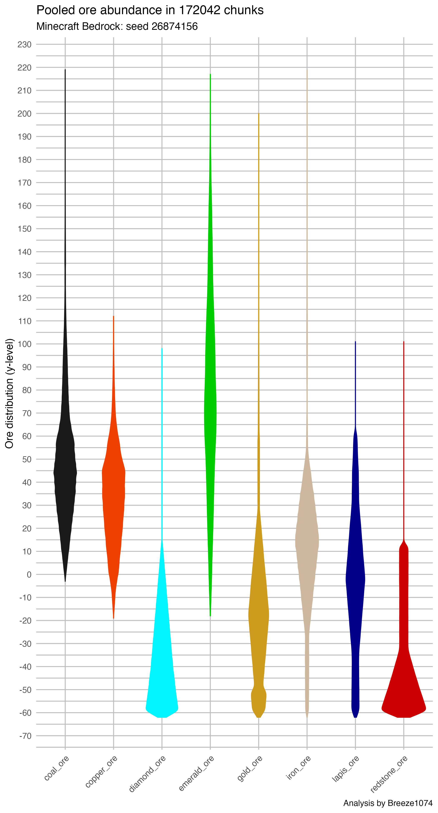

Ore Abundance in Minecraft Bedrock Edition
================

**By:** Breeze1074 (CrazyBreeze1074)  
**Credit to:** RufusAtticus for
[rbedrock](https://github.com/reedacartwright/rbedrock) support.

Minecraft necessarily requires mining for resources, especially in the
early game, or for players not inclined to build elaborate farms. This
makes it important to know where in the world is best for finding the
desired ores?

The answer to this question depends on if you are mining in peak biomes
or in other terrain. In peaks we can find coal, copper, emeralds, and
iron are distributed abundantly above sea level. However in other biomes
we find these ores are distributed at different intervals.

For example, in the image below I used data from a fresh minecraft world
using seed 1638586699. I then teleported to various locations with peak
biomes predicted by [Chunk
Base](https://www.chunkbase.com/apps/seed-map#1638586699). After loading
more than 1000 chunks of data, I then analyzed block densities by
y-value. It is evident in data heavily biased to mountainous peaks that
the player can find abundant coal, emeralds, and iron at elevation.
Making mountains a lucrative search space for these resources, if the
terrain is plentiful.

At times, the player may need to access ores from mining the depths of
the world. Thus, I accessed a very large amount of 1.18 data with very
little bias to mountain biomes. This data came from seed 26874156 and is
credited to the patrons of
**[Prowl8413](https://www.youtube.com/c/Prowl8413)** for world
exploration. I tracked ore positions in more than 170,000 chunks with
this data. Looking specifically at regular ores we can see compare
distributions. In contrast to peaks, here we find that resource
acquisition requires selection of a y-level appropriate for your target
ore, or compromised for a blend of a few ores. For example, this world
data suggests mining around *y = 47* to *y = 43* is best for acquiring
coal and ore. Mine instead at *y = 13* to get the most iron ore.
However, a pretty good compromise can be made by mining around *y = 25*
if the player needs early access to coal and iron both. Diamonds and
redstone are easiest to find by mining deep in the world. Another
compromise can be reached around *y = -10* the player may find early
access to diamonds, gold, iron, lapis, and redstone at the same time.

On the whole, most of the ore types are abundant, if the player searches
as the appropriate y-level. There are two exceptions: deepslate coal ore
and deepslate emerald ore. Both of these ore types are exceedingly rare,
and on economy servers could even replace diamonds as a high value
currency. In the &gt;170,000 chunks of world data from Prowl’s patron
world, deepslate coal is only found at *y = -1, -2, or -3*. Deepslate
emeralds can be found more widely distributed between *y = -1* to *y \~
-22*. While deepslate coal can be found throughout the world at its
level range, keep in mind that deepslate emeralds are restricted to
mountain biomes. 
