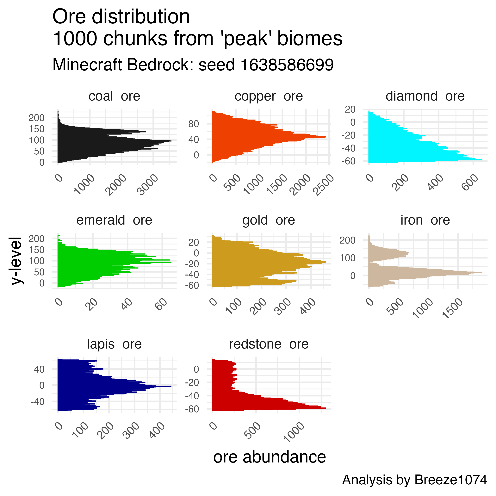

Ore abundance in Minecraft Bedrock Edition
================

**By:** Breeze1074 (CrazyBreeze1074)  
**Credit to:** RufusAtticus for
[rbedrock](https://github.com/reedacartwright/rbedrock) support.

Minecraft necessarily leads to mining for resources, especially in the
early game or for players not inclined to building elaborate farms. This
makes it important to know where in the world is best for finding the
desired ores.

The answer to this question depends on if you are mining in peak biomes
or in other terrain. In peaks we can find coal, copper, emeralds, and
iron are distributed abundantly above sea level. However in other biomes
we find these ores are distributed at different intervals.

For example, in the image below I used data from a fresh minecraft world
using seed 1638586699. I then teleported to various locations with peak
<<<<<<< HEAD
biomes predicted by [Chunk
Base](https://www.chunkbase.com/apps/seed-map#1638586699). After loading
more than 1000 chunks of data, I then analyzed block densities by
y-value:  
=======
biomes predicted by
[chunkbase](https://www.chunkbase.com/apps/seed-map#1638586699.). After
loading more than 1000 chunks of data, I then analyzed block densities
by y-value:  
>>>>>>> 9f0d43fc181a997ae9b377017b3c2691d075e76a

